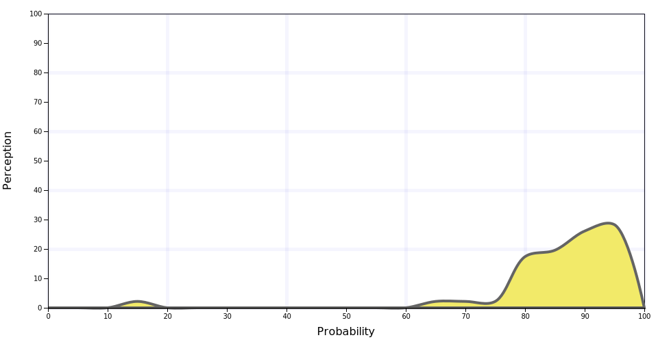

# Perceptions Of Probability
Scrum Estimative using Perceptions of Probability

## Wait, What?

When we ask an estimative from a task, in general, we expect a number.
But the true estimation is, in fact, a [probabilistic shape](https://youtu.be/p0O1VVqRSK0?t=37m02s).
Probabilistic curves to estimation allow the manager to consider all the possible
outcomes, and the chance of each one of them.

The problem is to properly describe a probabilistic shape demands to much
effort and to many interactions. So, companies tend to avoid this approach.
One [study from the Sherman Kent CIA about perceptions of probabilistic](https://github.com/zonination/perceptions) shows
how popular probabilistic terms are perceived and presents a probabilistic
curve to each term.

This project describes how to draft a task complexity probabilistic shape
using only 3 simple questions:

1. Optimist Estimative
2. Pessimist Estimative
3. Chance of Optimist

Answering those questions to the [calculator](calculator.html) it is possible to get the curve and some other metrics.

There is also a [printer friendly page with cards the probabilistic terms](cards.html).
Each card provides the curve and the most likely value, based on the optimist and pessimist values.
The goal of these cards are for being used on off-line meetings.

On other option is download the [Google Docs Spreadsheet](https://docs.google.com/spreadsheets/d/1DDj2PIKxt8Pk0GD5m7FDDEv93QS1qBK82moUxwcK7mA/edit?usp=sharing)
that presents many of the core features of this projects.

## Likely Perception List:

### Almost Certainly
  
### Highly Likely
  
### Very Good Chance
  
### Likely
  
### Probable
  
### Probably
  
### We Believe	 
  
### Better Than Even
  
### About Even
  
### We Doubt
  
### Improbable
  
### Probably Not
  
### Unlikely
  
### Little Chance
  
### Chances Are Slight
  
### Highly Unlikely
  
### Almost No Chance
  
