# Perceptions Of Probability
This project defines an extra dimension to task estimation based on this study https://github.com/zonination/perceptions.

## Draft on Google Docs
A draft of the project is running on https://docs.google.com/spreadsheets/d/1DDj2PIKxt8Pk0GD5m7FDDEv93QS1qBK82moUxwcK7mA/edit?usp=sharing

## The Process

The estimation process, is similar to the Agile Cards, but instead of just givin one value, each developer gives 3 answers:
- In the optmist scenario, what is the complexity of this task? 3 for example
- In the pessimist scenario, what is the complexity of this task? 10 for example
- What is the likely of the optmist scenario? Answer from the likely perception list.

Based on this values - and optionaly the error margin - we can calculate the safe range of values.

## Likely Perception List:

### Almost Certainly
  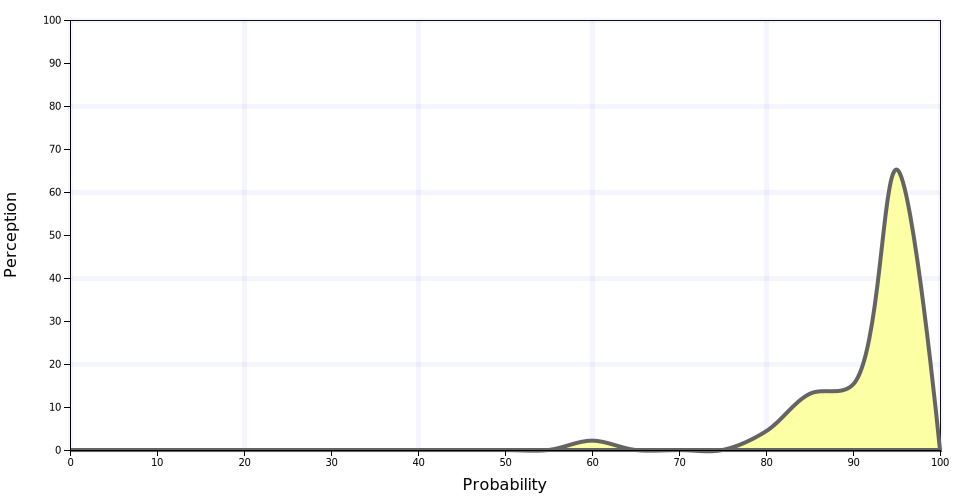
### Highly Likely
  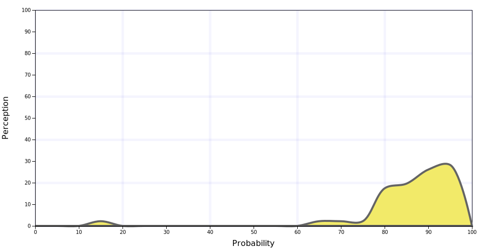
### Very Good Chance
  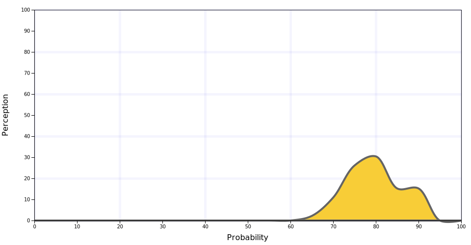
### Likely
  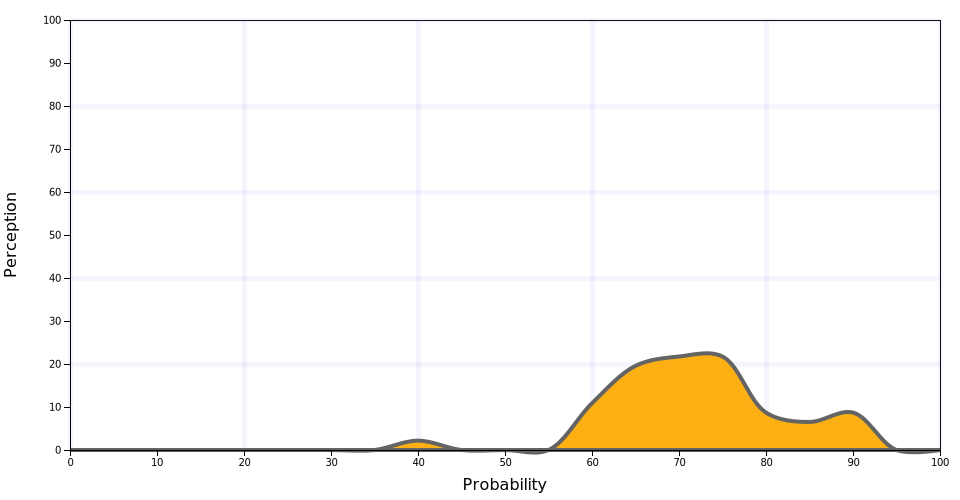
### Probable
  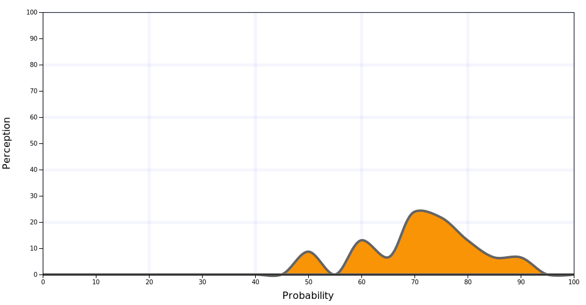
### Probably
  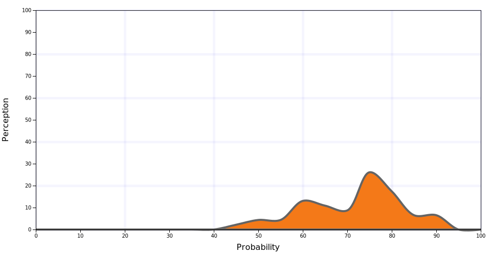
### We Believe	 
  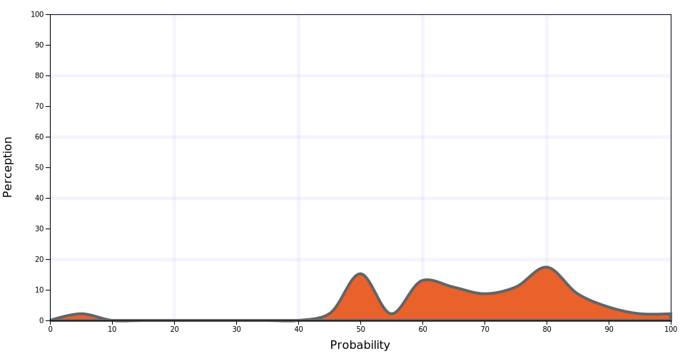
### Better Than Even
  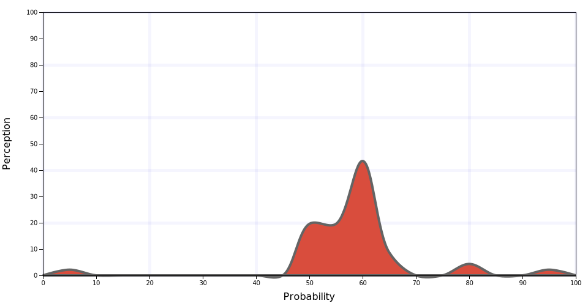
### About Even
  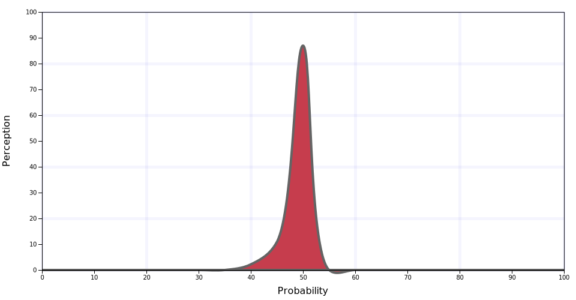
### We Doubt
  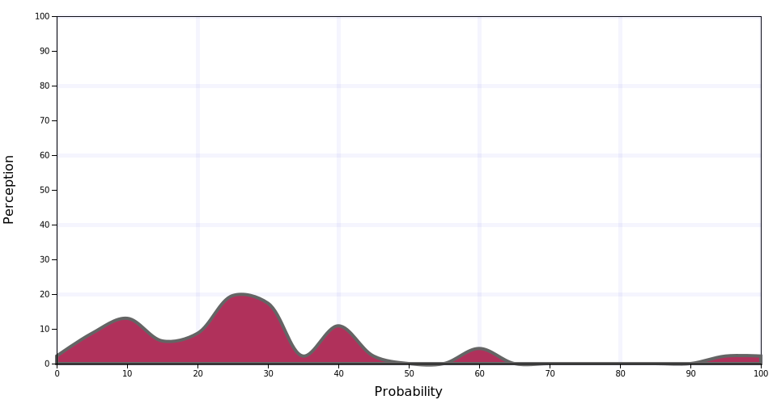
### Improbable
  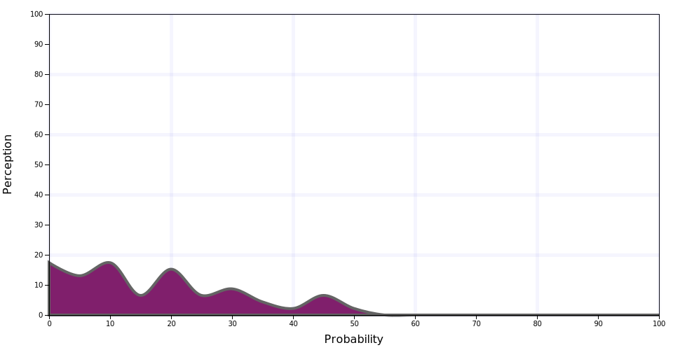
### Probably Not
  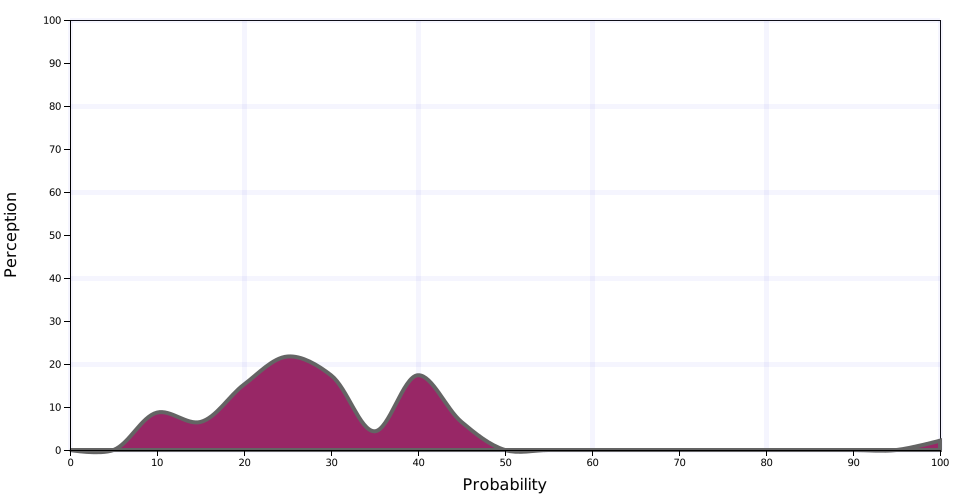
### Unlikely
  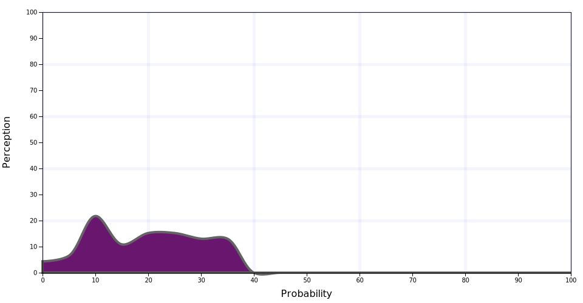
### Little Chance
  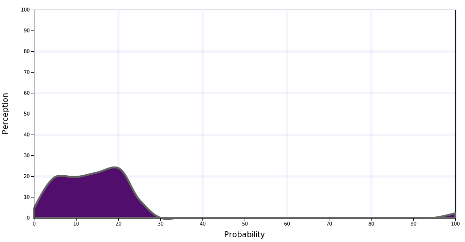
### Chances Are Slight
  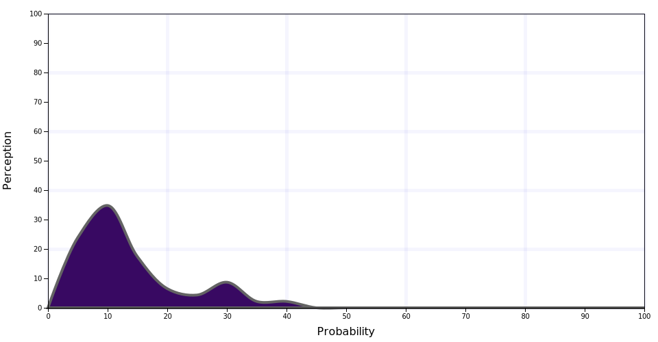
### Highly Unlikely
  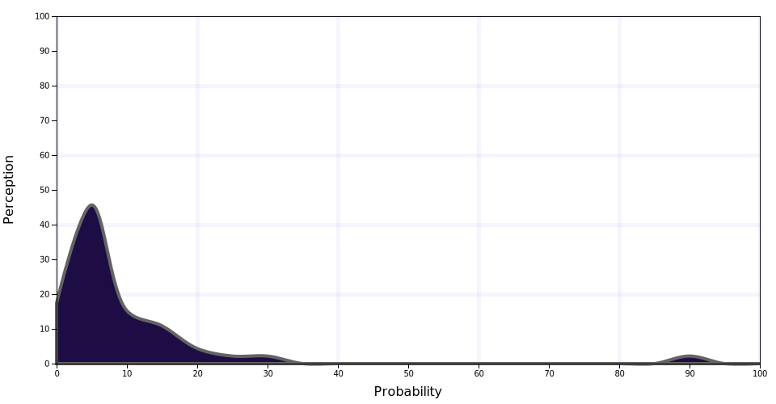
### Almost No Chance
  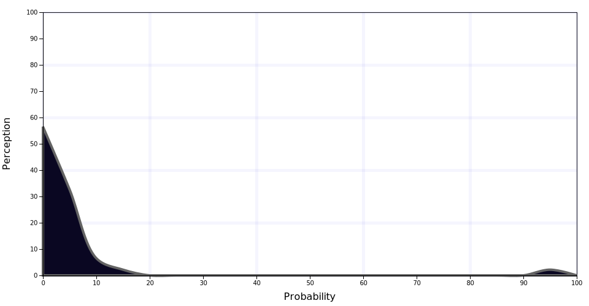
